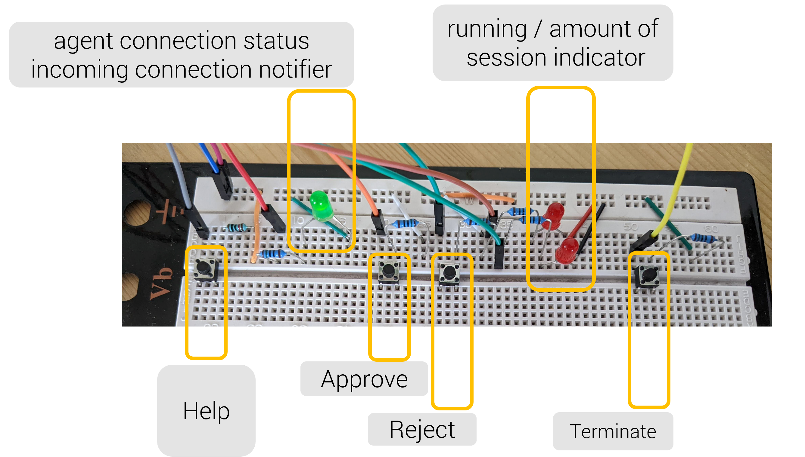

# TeamViewer instant support integration
This demo code integrates the [TeamViewer Agent Api](https://github.com/teamviewer/iotagentsdk) into a demonstration, 
showing the instant support functionality management just with hardware elements.
This demo shows an use case, where the management of the TeamViewer support capabilities is controlled via hardware elements.
It is possible to create a [service case](https://www.teamviewer.com/en/features/service-queue/) and manage incoming connection.
The user has the possibility to press two buttons to either allow or reject the incoming connection.
The red LED's are indicating running TeamViewer session. For every open connection, one LED is light up. For this demo only two participants are supported.
The last functionality is a button, which will terminate all ongoing sessions.



## Setup
The demo was build on a RaspberryPi 3 with Raspian 11 (bullseye).

Build the TeamViewer Agent API on your system. Do not forget to install the mentioned dependencies.
Also run the CMake command, so it enables the Python bindings [how to](https://github.com/teamviewer/iotagentsdk/blob/main/Bindings/Python/Readme.md)

In the Demo.py, search the function
```
requestSupportCase():
```
and enter you token on the field accessToken.

## Wiring 
to do
